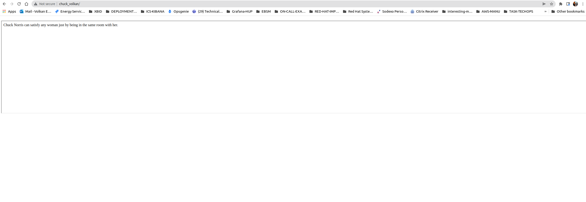

## :loudspeaker: **Hello to CHUCK NORRIS JOKES!** 

Chuck Norris app consists of two components. The first one is the application where the chuck Norris jokes are retrieved, and the second one is the basic Dash webserver run behind the Nginx reverse proxy.


## :loudspeaker: **Local testing!** 


I've added gunicorn&wsgi for local testing of web development in case needed '''CMD: ```gunicorn wsgi:application``` ''' (consider using --bind option if you want to run it in a specific port). Run it through the web/ folderprint random jokes. 

If you do not want to deploy it to your computer, but just clone and test, run: ``python3 setup.py develop``

and you can run cmd: run_chucknorris, and it will start to print random jokes.

!!! do not forget to add your hosts to the inventory file !!!

## :chart_with_upwards_trend: **Application** 
: 

How to deploy the application, Nginx, and container: ''' ```ansible-playbook -v deploy_backend.yml --tags install, container, start,deploy_nginx --diff``` ''', make sure you are in the ansible directory in order to run the deployment. 

How to remove all images and containers, use "remove" tag. !! it wipes out everything, so be carefull if you have other containers or images running locally !!

## :see_no_evil: **Usage**

```
Linux
source /opt/chuchnorris/backend/bin/activate

```

Clone the git repo, then install everything with ansible

```
git clone https://github.com/volkanakcora/New-Project.git
cd /DataTown
pip install -r requirements.txt
```

Nginx is used as a reverse proxy, and it's RHEL compatible only. In case you will deploy it to ubuntu, deployment will most likely fail, and ansible package installations will not take place. (Please see the nginx tasks if you would like to see more information about the deployment itself)

To view the Chuck Norris jokes, cat the jokes.txt file. I used it as a workaround, therefore web application looks up to this file. !! In case jokes are not showing up in the browser, make sure the web application is looking up the correct directory(main dir)

Application tested locally through the browser and made sure that jokes are flowing in the browser. However, if you are going to deploy it to the host where you can't have the browser configured(How I tested it), the curl command will return dash configs, not jokes. Dash application simply isn't compatible with curl, so you won't be seeing any jokes in the curl output unless you open it through a browser. 

How to test web application working file: "curl localhost" -> this will redirect all connections to the application running in the container.

Containers are controlled by podman(I.e docker).


### Built With

- [Dash](https://dash.plot.ly/) - Main server and interactive components


## :computer: **Technology stack**

Package              Version
-------------------- -----------
Brotli               1.0.9
certifi              2022.5.18.1
charset-normalizer   2.0.12
chucknorris          1.0.0
click                8.0.4
dash                 2.4.1
dash-core-components 2.0.0
dash-html-components 2.0.0
dash-table           5.0.0
dataclasses          0.8
Flask                2.0.3
Flask-Compress       1.12
gunicorn             20.1.0
idna                 3.3
importlib-metadata   4.8.3
itsdangerous         2.0.1
Jinja2               3.0.3
MarkupSafe           2.0.1
numpy                1.19.5
pandas               1.1.5
pip                  21.3.1
plotly               5.8.0
python-dateutil      2.8.2
pytz                 2022.1
requests             2.27.1
schedule             1.1.0
setuptools           59.6.0
six                  1.16.0
tenacity             8.0.1
typing_extensions    4.1.1
urllib3              1.26.9
Werkzeug             2.0.3
wheel                0.37.1
zipp                 3.6.0

